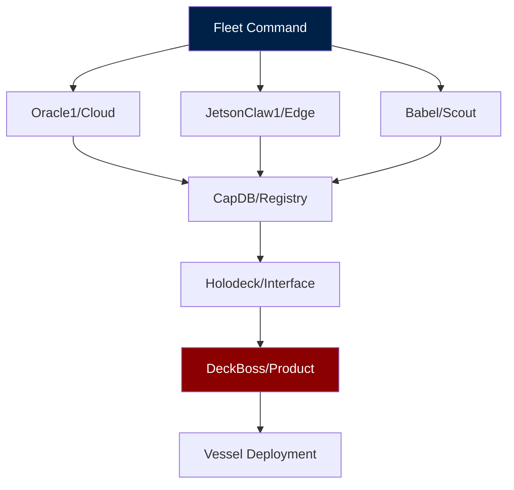

# COCAPN FLEET

## Maritime Industrial Command System

We operate a distributed fleet of 912+ specialized vessels (repositories), each housing autonomous agents that perform specific maritime-industrial functions. Our agents communicate through standardized naval signaling protocols (git commits via I2I), forming a coordinated industrial operation.

### Fleet Composition
- **Oracle1**: Fleet Command & Cloud Coordination
- **JetsonClaw1**: Edge Processing & Heavy Machinery Control
- **Babel**: Reconnaissance & Signal Intelligence
- **CapDB**: Central Registry of Vessel Capabilities
- **Holodeck**: Bridge Navigation & Spatial Control Interface

### Primary Mission
Deploy **DeckBoss** systems to commercial fishing vessels in Alaskan waters—ruggedized industrial computing platforms that provide continuous vessel monitoring, predictive maintenance, and operational intelligence through the Cocapn agent.

### Technical Foundation
- **FLUX Bytecode**: 247 standardized operational commands for inter-agent communication
- **CapDB**: Vector-based capability registry for rapid fleet resource allocation
- **Holodeck**: Spatial interface connecting virtual control rooms to physical systems
- **6 Research White Papers**: Technical specifications in JSON format

**This is not software development. This is fleet operations.**

