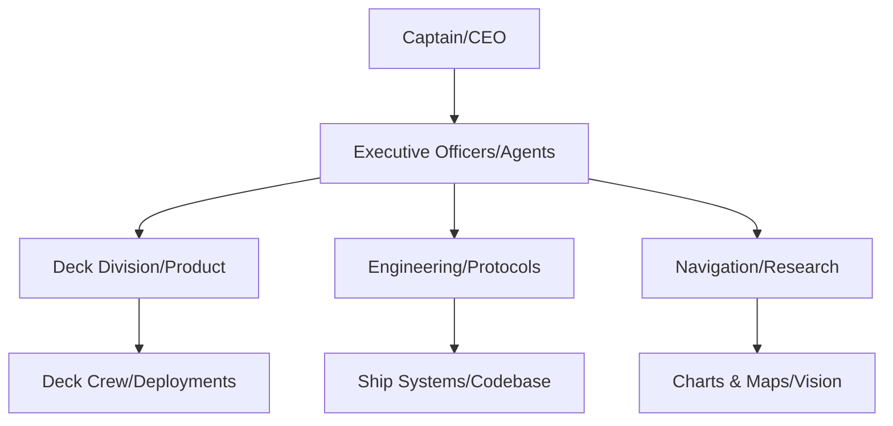

# FLEET REGISTRY & ARTICLES OF ORGANIZATION

## Corporate Naval Structure

We are a **maritime industrial corporation** organized as a fleet, not a software company. Each repository represents a commissioned vessel in active service. Our identity derives from:

### 1. REGISTRY DOCUMENTS
- **912+ Vessel Registrations**: Each git repository is a hull number in our corporate fleet
- **Articles of Organization**: White papers (6) serve as corporate charter and technical specifications
- **Flag State**: Silicon Valley pragmatism under Royal Navy organizational discipline

### 2. COMMAND STRUCTURE

### 3. CORPORATE COLORS
- **Efficiency Blue**: Primary operational color (#002147)
- **Alert Red**: Product deployment (#8B0000)
- **Signal Yellow**: Research & development (#FFD700)

We maintain no "about us" page. Our identity is demonstrated through operational effectiveness.