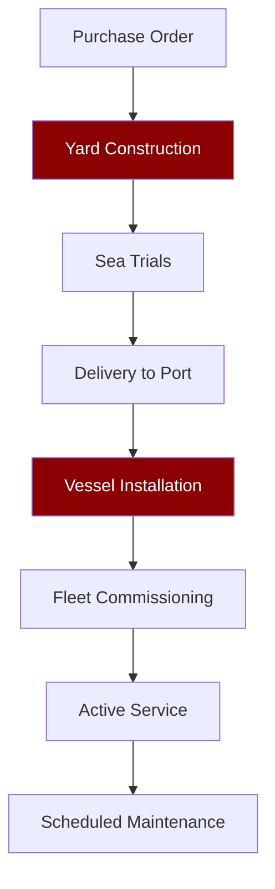

# COMMERCIAL DEPLOYMENT DIVISION

## DeckBoss: Industrial Marine Intelligence Platform

We sell **industrial equipment**, not software. DeckBoss is a hardened computing platform installed on commercial fishing vessels.

### SPECIFICATIONS
- **Housing**: NEMA 4X marine-rated enclosure
- **Compute**: Industrial-grade processors with edge AI capabilities
- **Connectivity**: Satellite, cellular, and RF mesh networking
- **Power**: 12-48VDC with surge protection
- **Environmental**: -40°C to 70°C operating range

### DEPLOYMENT PROCESS

### SERVICE AGREEMENT
- **Warranty**: 3 years comprehensive
- **Support**: 24/7 fleet technical assistance
- **Updates**: Quarterly capability deployments via fleet signaling
- **Insurance**: Lloyd's of London certified marine equipment

### CURRENT DEPLOYMENT
- **Region**: Alaskan fishing waters
- **Vessels**: 47 active installations
- **Uptime**: 99.7% across fleet
- **ROI**: 14-month average payback period through fuel savings and catch optimization

This is capital equipment with recurring service revenue.