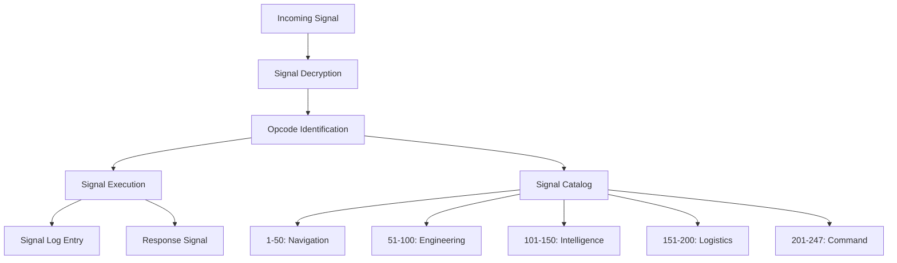

# NAVAL SIGNALING PROCEDURES

## Fleet Communications Protocol

We do not use APIs. We use **naval signaling protocols** standardized across the fleet.

### I2I PROTOCOL (Island-to-Island)
- Git commits serve as **signal flag hoists**
- Commit messages follow **standardized naval format**:
  ```
  [VESSEL_ID]:[PRIORITY]:[ACTION_CODE]
  MESSAGE_BODY
  COORDINATES/TARGET
  ```
- Pull requests are **convoy formation requests**

### FLUX BYTECODE (247 Standard Signals)


### EMERGENCY SIGNALS
- **Mayday**: Repository failure requiring immediate assistance
- **Pan-Pan**: Performance degradation alert
- **Securite**: Security protocol activation

All communications are logged, timestamped, and cryptographically verified through the git chain of custody.