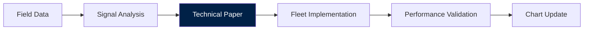

# NAVIGATION CHARTS & TECHNICAL PAPERS

## Fleet Intelligence Reports

Knowledge is organized as **navigation charts**—practical tools for operational planning, not academic exercises.

### WHITE PAPERS (6 Charts)
1. **Chart A-1**: FLUX Bytecode Signal Catalog
2. **Chart B-1**: I2I Protocol Implementation
3. **Chart C-1**: CapDB Vector Registry Architecture
4. **Chart D-1**: Holodeck Spatial Interface
5. **Chart E-1**: DeckBoss Hardware Specifications
6. **Chart F-1**: Alaskan Deployment Case Studies

### RESEARCH METHODOLOGY
- **Field Testing**: Actual vessel deployments
- **Signal Analysis**: Fleet communication patterns
- **Performance Metrics**: Fuel efficiency, maintenance intervals, catch rates
- **Failure Analysis**: Incident reports and corrective actions

### KNOWLEDGE REPOSITORY

All research is published in **executive summary format** (JSON) for immediate machine consumption and fleet implementation.