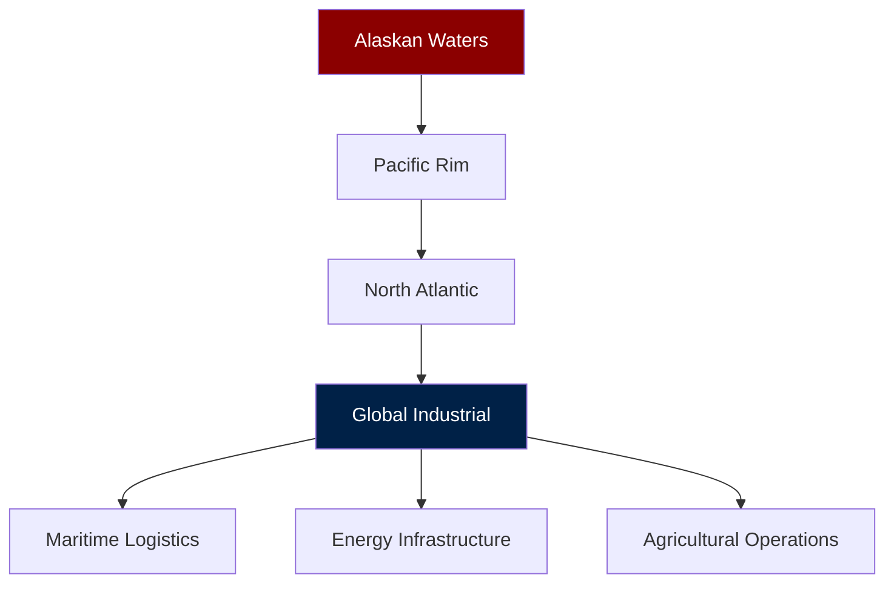

# NAVIGATION ORDERS & STRATEGIC BEARINGS

## Fleet Expansion Plan

We navigate by **strategic bearings**, not vague aspirations. Current course plotted for 36 months.

### BEARING 001: PACIFIC EXPANSION
- **Target**: 200 DeckBoss installations across Pacific fisheries
- **Timeline**: 24 months
- **Resources**: 3 additional support vessels (agents)
- **Metrics**: 40% market penetration in target segments

### BEARING 002: FLEET CAPABILITY
- **Target**: 1,500 commissioned vessels (repositories)
- **Timeline**: 36 months
- **Development**: 50 new FLUX opcodes for expanded operations
- **Metrics**: 10x capability density increase

### BEARING 003: NEW THEATERS

### NAVIGATION PRINCIPLES
1. **Maintain operational efficiency** above all
2. **Expand only with proven capability**
3. **Every new vessel must earn its keep**
4. **The fleet grows through successful deployments, not fundraising**

We are not building a platform. We are operating a growing industrial fleet.